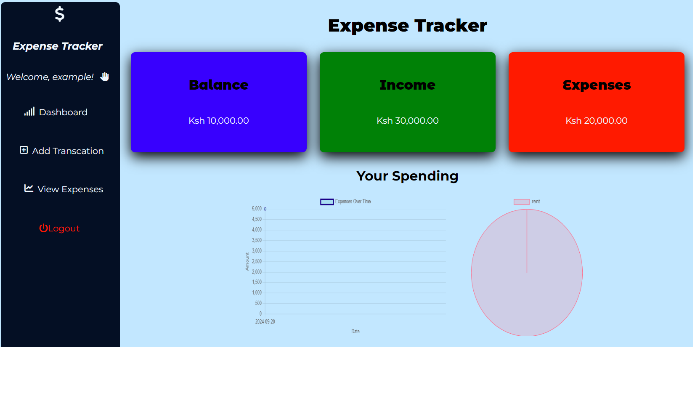

# Expense Tracker

## Overview

The **Expense Tracker** is a web-based application designed to help users manage and track their daily expenses efficiently. Built using modern technologies such as JavaScript, EJS, Node.js, Express, and MySQL, this application offers a seamless and user-friendly experience for budgeting and expense management.



- **Pitch Deck**: [Link to the project pitch deck](https://gamma.app/docs/Expense-Tracker-Take-Control-of-Your-Finances-4i177ugbdcjn33o)

## Features

- **User Authentication**: Secure user registration and login functionality to ensure data privacy.
- **Expense Management**: Add, edit, and delete expenses, categorized by type (e.g., food, transportation, entertainment).
- **Dashboard**: Visualize your spending habits through charts and graphs, providing insights into your financial health.
- **Expense Reports**: Generate reports for specific time periods to track spending patterns.
- **Responsive Design**: Accessible on any device, ensuring a consistent experience across desktops, tablets, and mobile phones.

## Technologies Used

### Frontend

- **JavaScript**: For dynamic client-side interactions and logic.
- **EJS (Embedded JavaScript)**: Templating engine for rendering HTML with embedded JavaScript code.
- **CSS**: Styling the application for a clean and intuitive user interface.

### Backend

- **Node.js**: Server-side JavaScript runtime used to build scalable network applications.
- **Express.js**: Fast, unopinionated, and minimalist web framework for Node.js, managing routes, middleware, and HTTP requests.
- **MySQL**: Relational database management system to store and retrieve user and expense data.

## How to Run the Application

### Prerequisites

- **Node.js** installed on your machine.
- **MySQL** installed and running.
- **Git** for version control (optional).

### Steps to Run Locally

1. Clone the repository:
   ```bash
   git clone https://github.com/swaepapi/Expense-Tracker.git
